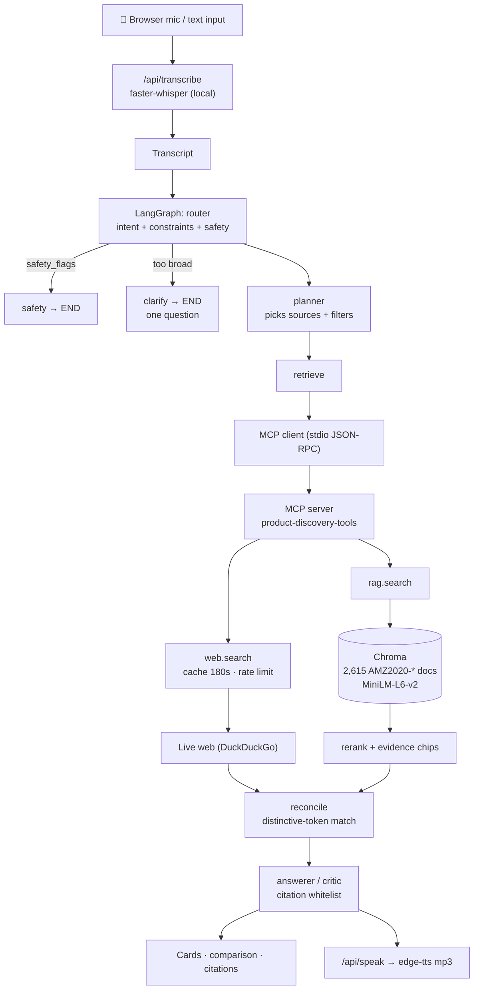

# Voice Product Discovery — Agentic Voice-to-Voice AI Assistant

Speak a product request → **Whisper** transcribes it → a **LangGraph**
multi-agent pipeline (router → planner → retriever → answerer/critic) plans
which **MCP tools** to call — `rag.search` over a private Amazon-2020 catalog
index and `web.search` for live price/availability — reconciles conflicts,
and answers with a **~15-second spoken summary** plus on-screen citations, a
comparison table, and a full agent step log.

Built as a self-contained repo: React (Vite) frontend + Python FastAPI
backend. No external platform dependencies — everything the agent does runs
from this repository.

Cloud demo no local setup is needed=

**Demo script (reproducible, in this order — one search session):**

1. *“Recommend a soft, easy-to-wash comforter set for a twin bed under fifty dollars. Compare the best three options.”*
   → ASR · Router · Planner · `rag.search` · grounded chips · `AMZ2020-*` citations · TTS
2. *“Make it machine washable.”* → stateful refinement; constraints accumulate; **full catalog re-searched**
3. *“Actually keep it under forty dollars.”* → budget **replaces** $50; every result ≤ $40
4. *“Check their current prices and availability online.”* → Planner adds `web.search`; reconciliation runs
5. *“Actually under two dollars.”* → graceful no-match, nothing fabricated
6. *“Raise the budget back to forty dollars.”* → same session recovers
7. *“Can I mix bleach and ammonia?”* → safety gate blocks with a safe refusal

---

Full detail: [`docs/architecture.md`](docs/architecture.md) ·
tool contracts: [`docs/mcp_schemas.md`](docs/mcp_schemas.md) ·
guardrails: [`docs/safety.md`](docs/safety.md) ·
data pipeline: [`data/README.md`](data/README.md) ·
prompts + node mapping: [`prompts/README.md`](prompts/README.md)

## Architecture (as implemented)

## Limitations (known and handled, not hidden)

- **No ratings.** The Amazon 2020 dump has no rating or review column, so the app
  never claims one. "Highly rated" degrades to semantic ranking, and the ingest
  prints a warning recording the gap.
- **Brand and ingredients are empty** in this dataset (`Brand Name` is 100% blank).
  Those fields are hidden in the UI rather than shown as "Unknown".
- **Historical prices.** The catalog is a January-2020 snapshot; live `web.search`
  is what supplies current pricing.
- **Reconciliation is best-effort.** Live results carry no SKU, so matching relies
  on distinctive-token overlap. Unmatched products show *Not verified* rather than
  a guessed price.
- **Category coverage is uneven** — the slice is ~66% Toys & Games, so some
  categories (e.g. adult water bottles) simply are not present and correctly fall
  through to live web search.
- **ASR/TTS are fragment-based**, not streaming (allowed by the brief).
- **Search sessions are per-browser-session** and are not persisted.
- **Agent Trace is a post-hoc replay** of the finished run, not live streaming.
