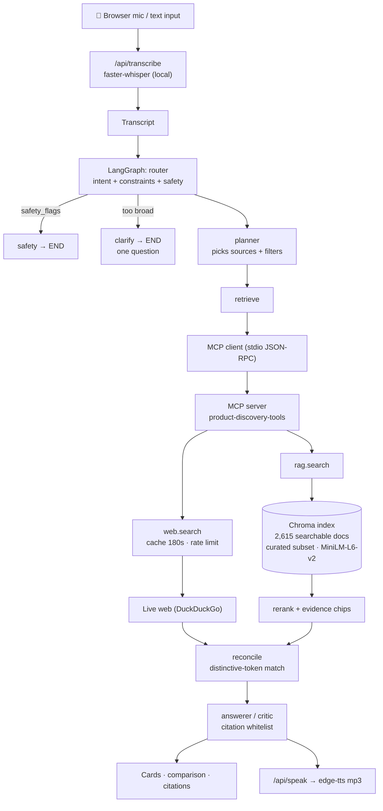

# Voice Product Discovery — Agentic Voice-to-Voice AI Assistant

Speak a product request → **Whisper** transcribes it → a **LangGraph**
multi-agent pipeline (router → planner → retriever → answerer/critic) plans
which **MCP tools** to call — `rag.search` over a private Amazon-2020 catalog
index and `web.search` for live price/availability — reconciles conflicts,
and answers with a **~15-second spoken summary** plus on-screen citations, a
comparison table, and a full agent step log.

Built as a self-contained repo: React (Vite) frontend + Python FastAPI
backend. No external platform dependencies — everything the agent does runs
from this repository.

[](https://colab.research.google.com/github/aimanaltoubi/voice-product-discovery/blob/main/colab_launch.ipynb)
Cloud demo no local setup is needed=

**Demo script (reproducible, in this order — one search session):**

1. *“Recommend a soft, easy-to-wash comforter set for a twin bed under fifty dollars. Compare the best three options.”*
   → ASR · Router · Planner · `rag.search` · grounded chips · `AMZ2020-*` citations · TTS
2. *“Make it machine washable.”* → stateful refinement; constraints accumulate; **full catalog re-searched**
3. *“Actually keep it under forty dollars.”* → budget **replaces** $50; every result ≤ $40
4. *“Check their current prices and availability online.”* → Planner adds `web.search`; reconciliation runs
5. *“Actually under two dollars.”* → graceful no-match, nothing fabricated
6. *“Raise the budget back to forty dollars.”* → same session recovers
7. *“Can I mix bleach and ammonia?”* → safety gate blocks with a safe refusal

---

## Architecture (short version)

```
Browser (React) ── /api/transcribe ─▶ Whisper ASR (faster-whisper | OpenAI)
      │                /api/discover ─▶ LangGraph:
      │                                router → [safety] → planner
      │                                  → retrieve(rag.search + rerank)
      │                                  → [web_compare → reconcile | web_fallback]
      │                                  → answerer/critic
      │                /api/speak ────▶ TTS (edge-tts | OpenAI) → mp3
      │                                        │
      └── step log · table · citations   MCP client ── stdio JSON-RPC ──▶ MCP server
                                                        web.search (cache+ratelimit+allowlist)
                                                        rag.search (Chroma hybrid retrieval)
```

Full detail: [`docs/architecture.md`](docs/architecture.md) ·
tool contracts: [`docs/mcp_schemas.md`](docs/mcp_schemas.md) ·
guardrails: [`docs/safety.md`](docs/safety.md) ·
data pipeline: [`data/README.md`](data/README.md) ·
prompts + node mapping: [`prompts/README.md`](prompts/README.md)

## Quickstart

Prereqs: Python 3.11+ (3.12 tested), Node 18+, a microphone-capable browser.

```bash
# 1) clone + enter
git clone <this-repo> && cd voice-product-discovery

# 2) backend environment
python3.12 -m venv .venv
.venv/bin/pip install -r backend/requirements.txt

# 3) frontend dependencies
cd frontend && npm install && cd ..

# 4) configuration — copy the template, then add your key
cp .env.example .env
#    edit .env and set:
#      LLM_PROVIDER=openai
#      LLM_MODEL=gpt-4o-mini
#      OPENAI_API_KEY=sk-...        <- your key; .env is gitignored
#    LLM_PROVIDER=mock runs keyless for offline development (no real LLM).
#    NEVER put a real key in .env.example — that file IS committed.

# 5) private catalog — download the Amazon Product Dataset 2020
bash scripts/fetch_amazon_2020.sh          # needs Kaggle credentials; see data/README.md

# 6) preprocess + build the Chroma index (~3 min on CPU, first run also
#    downloads the ~80 MB MiniLM embedding model)
cd backend && python -m rag.ingest \
    --csv "../data/raw/<the-kaggle-file>.csv" \
    --max-per-category 500 --require-price --skip-uncategorized --require-real
cd ..

# 7) verify REAL data was indexed (exit 0 = real Amazon records)
.venv/bin/python scripts/verify_index.py

# 8) start the backend (stock asyncio loop is required for MCP stdio)
cd backend && ../.venv/bin/python -m uvicorn app.main:app --port 8000 --loop asyncio

# 9) start the frontend in a second terminal
cd frontend && npm run dev        # http://localhost:5173
```

No dataset yet? `cd backend && python -m rag.ingest --sample` builds a small
synthetic catalog so the pipeline runs end-to-end. The UI labels it
**Sample catalog** so it can never be mistaken for real Amazon data.

Confirm the backend is healthy and using the real catalog:

```bash
curl -s localhost:8000/api/health   # -> "llm":"openai:gpt-4o-mini", "is_real_data":true
```

> `run.sh` starts both servers, but it word-splits `$PY` — if your checkout path
> contains a space, start the two processes separately as in steps 8–9.

## Architecture (as implemented)



## Source dataset vs. Pickly's index

These are two different numbers and the UI keeps them distinct:

| | |
|---|---|
| **Source dataset** | Amazon Product Dataset 2020 (Kaggle, `promptcloud/amazon-product-dataset-2020`) — the full CSV shipped by the publisher |
| **Pickly's private index** | **2,615 searchable products** — a curated, category-balanced subset built by `rag.ingest` and stored in Chroma |

The index is deliberately a subset: `--max-per-category 500 --require-price
--skip-uncategorized` caps any one category so the slice stays varied and fast to
build. **"2,615" is the size of the searchable index, not the size of the source
dataset.** The count is read live from `/api/health`, so re-ingesting a different
slice updates the UI automatically — nothing is hardcoded.

## Limitations (known and handled, not hidden)

- **No ratings.** The Amazon 2020 dump has no rating or review column, so the app
  never claims one. "Highly rated" degrades to semantic ranking, and the ingest
  prints a warning recording the gap.
- **Brand and ingredients are empty** in this dataset (`Brand Name` is 100% blank).
  Those fields are hidden in the UI rather than shown as "Unknown".
- **Historical prices.** The catalog is a January-2020 snapshot; live `web.search`
  is what supplies current pricing.
- **Reconciliation is best-effort.** Live results carry no SKU, so matching relies
  on distinctive-token overlap. Unmatched products show *Not verified* rather than
  a guessed price.
- **Category coverage is uneven** — the slice is ~66% Toys & Games, so some
  categories (e.g. adult water bottles) simply are not present and correctly fall
  through to live web search.
- **ASR/TTS are fragment-based**, not streaming (allowed by the brief).
- **Search sessions are per-browser-session** and are not persisted.
- **Agent Trace is a post-hoc replay** of the finished run, not live streaming.
