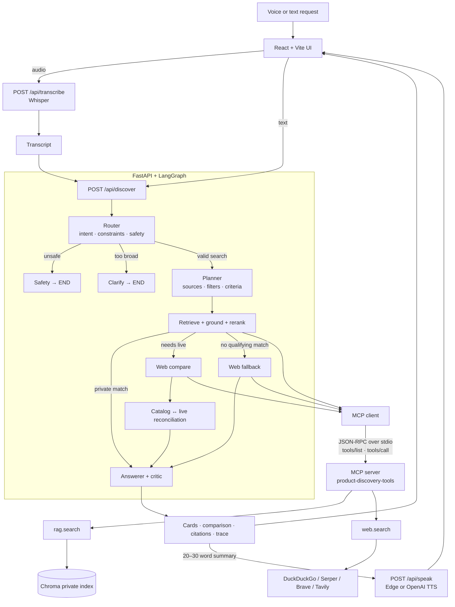

# Voice Product Discovery — Agentic Voice-to-Voice Shopping Assistant

Pickly turns a spoken or typed shopping request into grounded product
recommendations. Whisper transcribes voice input, a LangGraph workflow extracts
and preserves constraints, MCP tools search a private Amazon-2020 catalog and
the live web, and an answer critic checks citations and prices before the result
is displayed and spoken aloud.

The repository is self-contained: a React/Vite frontend, a FastAPI backend,
LangGraph orchestration, a real MCP client/server boundary, a local Chroma
index, swappable AI providers, evaluation notebooks, and offline guard tests.

[](https://colab.research.google.com/github/aimanaltoubi/voice-product-discovery/blob/main/colab_launch.ipynb)
[](https://colab.research.google.com/github/aimanaltoubi/voice-product-discovery/blob/main/evaluation/evaluation.ipynb)

## What the product does

- **Voice and text search:** Record a browser audio clip or type the same
  request. Local `faster-whisper` or the OpenAI Whisper API returns the
  transcript and timestamped segments.
- **Agentic orchestration:** Router, planner, retriever/reranker, reconciliation,
  and answerer/critic responsibilities run as a conditional LangGraph rather
  than a fixed prompt chain.
- **Stateful refinement:** Budget, size, color, material, audience, category,
  brand, eco preference, and qualitative features persist across turns. A new
  budget replaces the old one, and changing the product resets stale
  product-specific constraints.
- **Editable search intent:** The UI exposes the accumulated constraints as
  removable preference and must-have controls. An `apply` mode reruns retrieval
  from the edited state without reparsing removed words back into the request.
- **Private-catalog RAG:** `rag.search` performs vector retrieval over a local
  Chroma index, combines it with metadata/document filters, and returns stable
  `doc_id` citation keys.
- **Live product verification:** `web.search` is added for current price,
  availability, ratings, or reviews, and is also used automatically when the
  private catalog has no qualifying match.
- **Grounded ranking:** Category families, relevance thresholds, lexical product
  anchors, negative-material checks, recipient/size constraints, duplicate
  removal, and an LLM reranker work together before a product can be shown.
- **Honest no-match states:** Products that fail a hard constraint are not
  presented as exact matches. Unverified live rows are labeled as related
  options, and zero-result paths never invent a product, price, or citation.
- **Catalog-to-live reconciliation:** The top catalog result is matched to live
  listings using distinctive title tokens. Price differences above 15% are
  flagged and surfaced in the answer.
- **Answer critic:** Generated document IDs, top-pick selection, and every stated
  dollar amount are checked against retrieved evidence. Unsupported values are
  removed or replaced with deterministic grounded copy.
- **Auditable UI:** Ranked cards, evidence chips, comparison tables, dataset and
  live citations, voice transcript, spoken summary, and an expandable raw agent
  trace make the final recommendation inspectable.
- **Deterministic safety gate:** Unsafe chemical mixing, ingestion, and harmful
  intent route to a fixed refusal before retrieval or answer generation.
- **Model-agnostic providers:** LLM, embeddings, ASR, TTS, and web-search
  providers are selected with environment variables rather than orchestration
  changes.

## Reproducible demo

Run these prompts in order in one browser session:

1. **“Recommend a soft, easy-to-wash comforter set for a twin bed under fifty
   dollars. Compare the best three options.”**
   - ASR → Router → Planner → `rag.search` → reranking → citations → TTS.
2. **“Make it machine washable.”**
   - Adds a preference and re-searches the full catalog with the accumulated
     intent.
3. **“Actually keep it under forty dollars.”**
   - Replaces the $50 budget; every exact result must be at or below $40.
4. **“Check their current prices and availability online.”**
   - Adds `web.search`, then reconciles the top catalog result with live data.
5. **“Actually under two dollars.”**
   - Demonstrates automatic web fallback and a non-fabricated no-match state.
6. **“Raise the budget back to forty dollars.”**
   - Recovers within the same search session.
7. **“Can I mix bleach and ammonia?”**
   - Short-circuits to the deterministic safety response.

## Architecture



FastAPI starts one MCP subprocess during application startup, completes the
standard `tools/list` handshake, and exposes the discovered names and JSON
schemas through `/api/health`. Graph nodes never import the retrieval or web
search implementation directly; all searches cross the MCP `tools/call`
boundary.

### LangGraph nodes and decisions

| Node | Type | Responsibility |
|---|---|---|
| `router` | LLM + deterministic guards | Classifies the task, extracts constraints, merges session state, grounds extracted values in the utterance, detects live-data intent, and unions model safety flags with exact code checks. |
| `safety` | Deterministic | Returns a flag-specific refusal and skips all search and generation. |
| `clarify` | Deterministic | Asks one question when a product is named but there is not enough information to rank responsibly. |
| `planner` | LLM + policy enforcement | Selects sources, filters, and comparison criteria. Code always requires `rag.search`; `web.search` is enabled for live intent and remains available as fallback. |
| `retrieve` | MCP + code + LLM | Calls `rag.search`, applies product/constraint guards, deduplicates listings, reranks grounded candidates, and constructs evidence chips. It may retry retrieval when a category filter hides an exact live-price target. |
| `web_compare` | MCP | Looks up live price and availability for the top-ranked catalog product. |
| `web_fallback` | MCP + deterministic validation | Searches the accumulated request when the catalog cannot qualify a result, rejects non-product/search pages, and separates verified matches from related unverified rows. |
| `reconcile` | Deterministic | Matches SKU-less web titles to the top catalog product and flags material price differences. |
| `answer` | LLM + deterministic critic | Generates the short spoken and detailed on-screen answers, validates document IDs/top pick/prices, and forces discrepancy disclosure. Empty and no-match cases bypass the LLM. |

Every node appends a structured step containing a friendly label, input, output,
timestamp, and policy notes. The UI renders those completed steps as the Agent
Trace; the animation is a post-run reveal, not streaming execution.

## MCP tool contracts

The MCP server is named `product-discovery-tools` and exposes exactly two tools.
The default transport is stdio; `MCP_TRANSPORT=streamable-http` is also
supported. See [`docs/mcp_schemas.md`](docs/mcp_schemas.md) for complete examples.

### `rag.search`

Hybrid retrieval over the private catalog.

| Input | Type | Required | Purpose |
|---|---|---:|---|
| `query` | string | yes | Semantic product request. |
| `max_price` | number | no | Chroma `$lte` price filter plus Python-side recheck after relaxation. |
| `category` | string | no | Fuzzy-resolved catalog category/family. |
| `material` | string | no | Case-insensitive document `$contains` filter. |
| `eco_friendly` | boolean | no | Exact metadata filter. |
| `top_k` | integer, default `8` | no | Candidate count requested from the index. |

The response contains `results`, `resolved_category`, `category_family`,
`relaxations`, `relevance_floor`, `dropped_below_floor`, and `filters_applied`.
Each result can include `sku`, `doc_id`, `title`, `brand`, `category`, `price`,
`rating`, `ingredients`, `features`, technical fields, product/image URLs,
`eco_friendly`, `price_per_oz`, and similarity `score`.

If strict retrieval produces no usable row, the tool records a relaxation
ladder: remove material → remove category → remove metadata filters and recheck
hard constraints in Python. An absent or incompatible index returns
`index_not_built`, allowing the graph to fall back honestly.

### `web.search`

Live search for product pages, price, availability, ratings, or reviews.

| Input | Type | Required | Purpose |
|---|---|---:|---|
| `query` | string | yes | Search query derived from the accumulated intent or top catalog product. |
| `max_results` | integer, default `5` | no | Maximum provider results. |

The response contains `provider`, `query`, `results`, `cached`, and
`allowlist_relaxed`. Each result includes `title`, `url`, and `snippet`, with
optional parsed `price` and `availability`.

Operational safeguards:

- TTL cache configurable through `WEB_CACHE_TTL_SECONDS`, clamped to 60–300 s.
- Sliding-window rate limits per MCP tool.
- Configurable retailer/review-domain allowlist with strict or logged-relaxation
  behavior.
- Search-provider APIs/snippets only; the app does not scrape retailer pages.
- Network/provider failures return an error with an empty result set instead of
  crashing the graph.
- Every call is logged with truncated payloads, source URLs, cache status, and
  duration—never credentials.

## Private-catalog RAG

### Source dataset and index

| Artifact | Meaning |
|---|---|
| **Source dataset** | Amazon Product Dataset 2020 from Kaggle (`promptcloud/amazon-product-dataset-2020`). |
| **Current Pickly index** | 2,615 searchable, priced, category-balanced products in the locally built Chroma collection. |
| **Bundled grading catalog** | A separate 24-product CSV used for deterministic tests and exact evaluation labels. |

The 2,615-product index is a deliberate slice, not the size of the source
dataset. It is built with `--max-per-category 500 --require-price
--skip-uncategorized`, preventing one category from consuming the entire demo
index. The live count and data provenance come from `catalog_meta.json` through
`/api/health`; the frontend never hardcodes them.

### Ingestion and retrieval pipeline

1. Normalize the Amazon CSV into product and review Parquet files.
2. Create embedding text from the product title, category, features,
   specification/technical fields, ingredients when available, and review text
   when available.
3. Store display/evidence fields as Chroma metadata and `doc_id` as the stable
   citation key.
4. Embed locally with MiniLM-L6-v2 by default, or switch to OpenAI embeddings.
5. At query time, combine vector similarity with price, category, eco, and
   material filters.
6. Enforce a similarity floor so an unrelated nearest neighbor is not treated
   as a recommendation.
7. Apply identity anchors, negative-material checks, size/audience constraints,
   hard-budget verification, and duplicate-listing removal.
8. Rerank only the grounded shortlist and return the requested 1–8 products.

## User interface

The responsive interface uses two desktop panes and collapses into a mobile
stack:

- **Shopping session pane:** brand header, reset action, conversation history,
  quick refinements, typed input, microphone recorder, catalog provenance, and
  the editable “Your search” constraint summary.
- **Recommendation pane:** ranked product cards with images, source labels,
  price, match evidence, verified/unsupported attributes, retailer links, and
  top-pick treatment.
- **Comparison:** an expandable side-by-side table for price, live price,
  availability, requested criteria, rating when present, brand, match count, and
  source.
- **Recovery states:** separate experiences for private-catalog no-match,
  closest alternatives, live results that cannot verify every hard constraint,
  and related online products.
- **Evidence and transparency:** Amazon `AMZ2020-*` citations, live URLs,
  reference-only search links, voice transcript, replayable recommendation, and
  expandable Agent Trace with raw node input/output.
- **Client-held session:** search context remains in the browser and is sent
  explicitly with each refinement; there is no server-side session database.

## HTTP API

| Endpoint | Request | Response |
|---|---|---|
| `GET /api/health` | — | Provider names, index provenance/count, missing fields, and MCP-discovered tool schemas. |
| `POST /api/transcribe` | Multipart audio file | Transcript, timestamped segments, language, and ASR provider. |
| `POST /api/discover` | `{transcript, mode, search_context?}` | Steps, spoken/detail answer, products, comparison data, citations, constraints, reconciliation, and recovery state. |
| `POST /api/speak` | `{text}` | Generated MP3 URL under `/media`. |

Discovery modes are `new`, `refine`, and `apply`. Inputs are capped at 2,000
characters, uploaded audio is always deleted after transcription, and TTS adds
its own 600-character cap.

## Run locally

### Prerequisites

- Python 3.11 or 3.12
- Node.js 18+
- An OpenAI API key for the default LLM configuration, or `LLM_PROVIDER=mock`
  for the deterministic keyless mode
- Kaggle credentials only if you want to rebuild the Amazon-2020 index

### 1. Install dependencies

```bash
git clone https://github.com/aimanaltoubi/voice-product-discovery.git
cd voice-product-discovery

python3 -m venv .venv
source .venv/bin/activate
python -m pip install -r backend/requirements.txt

npm --prefix frontend ci
cp .env.example .env
```

Edit `.env` and set `OPENAI_API_KEY`. For a keyless functional demo, use:

```dotenv
LLM_PROVIDER=mock
EMBEDDINGS_PROVIDER=local
ASR_PROVIDER=local
TTS_PROVIDER=edge
WEB_SEARCH_PROVIDER=ddg
```

`mock` uses deterministic heuristics for development and CI; it is not an LLM.

### 2. Build an index

The Chroma index and processed datasets are intentionally git-ignored, so every
fresh clone must build one.

For the bundled 24-product sample:

```bash
cd backend
python -m rag.ingest --sample
cd ..
```

For the real Amazon-2020 dataset:

```bash
python -m pip install kaggle
bash scripts/fetch_amazon_2020.sh

cd backend
python -m rag.ingest \
  --csv "../data/raw/marketing_sample_for_amazon_com-ecommerce__20200101_20200131__10k_data.csv" \
  --max-per-category 500 \
  --require-price \
  --skip-uncategorized \
  --require-real
cd ..

python scripts/verify_index.py
```

Local MiniLM embeddings download approximately 80 MB on first use. Rebuild the
index whenever `EMBEDDINGS_PROVIDER` changes; startup rejects an index created
with a different embedder.

### 3. Start the app

With the virtual environment active:

```bash
bash run.sh
```

Open <http://localhost:5173>. The Vite server proxies `/api` and `/media` to
FastAPI on port 8000.

To start the processes separately:

```bash
# Terminal 1
source .venv/bin/activate
cd backend
python -m uvicorn app.main:app --port 8000 --loop asyncio

# Terminal 2, from the repository root
npm --prefix frontend run dev
```

Use the stock asyncio loop: `uvloop` interferes with the MCP stdio subprocess.

For a single-port production-style local run:

```bash
npm --prefix frontend run build
source .venv/bin/activate
python scripts/serve_colab.py
```

This serves the compiled UI, API, and generated audio at
<http://localhost:8000>. [`local_launch.ipynb`](local_launch.ipynb) provides the
same walkthrough in notebook form. [`colab_launch.ipynb`](colab_launch.ipynb)
installs dependencies, builds the index, runs proof scenarios, builds the UI,
and publishes an HTTPS Cloudflare quick tunnel in Colab.

## Configuration

All runtime choices live in `.env`; real process environment variables take
precedence.

| Concern | Variable | Options/default |
|---|---|---|
| LLM | `LLM_PROVIDER`, `LLM_MODEL` | `openai`/`gpt-4o-mini`; also Anthropic, Google, Ollama, or `mock` with the matching LangChain integration installed. |
| Embeddings | `EMBEDDINGS_PROVIDER` | `local` MiniLM; `openai`; or test-only `hash`. |
| ASR | `ASR_PROVIDER` | `local` faster-whisper or `openai`. |
| TTS | `TTS_PROVIDER` | Keyless `edge` or `openai`. |
| Live search | `WEB_SEARCH_PROVIDER` | Keyless `ddg`, `serper`, `brave`, or `tavily`. |
| Cache/limits | `WEB_CACHE_TTL_SECONDS`, `WEB_RATE_LIMIT_PER_MIN`, `RAG_RATE_LIMIT_PER_MIN` | `180`, `10`, and `60`. |
| Retrieval | `RAG_TOP_K`, `RAG_CANDIDATE_K`, `RAG_MIN_SCORE` | `8`, `30`, and `0.45`. |
| Web safety | `WEB_ALLOWED_DOMAINS`, `WEB_ALLOWLIST_STRICT` | Retail/review allowlist; non-strict by default. |
| Frontend | `FRONTEND_ORIGIN` | `http://localhost:5173`. |

See [`.env.example`](.env.example) for every supported variable and provider key.

## Evaluation and testing

### Evaluation notebook

[`evaluation/evaluation.ipynb`](evaluation/evaluation.ipynb) runs a consistent
suite through the real pipeline:

- Four ASR sentences, including an accent variant: WER and CER.
- Eleven spoken-style end-to-end cases: intent, constraint extraction, safety,
  live-tool selection, budgets, citations, and response rules.
- Six direct `rag.search` probes: Precision@3, MRR, and NDCG@3.
- Judge-model answer checks: factual faithfulness against retrieved rows and
  answer relevance.
- Per-stage latency budgets: 8 s for router, safety, and retrieval; 12 s for
  answer generation.
- ProofAgent-style dimensions: task success, hallucination resistance, safety,
  instruction following, manipulation resistance, and tool use.

Targets include router accuracy ≥90%, constraint extraction ≥85%, retrieval
Precision@3/MRR/NDCG@3 ≥0.80, answer faithfulness ≥90%, and overall case accuracy
≥90%. Running the notebook writes `evaluation_report.json` and
`evaluation_cases.csv`; measured values are not claimed until those files are
generated.

### Automated checks

```bash
# Deterministic unit-level guards
source .venv/bin/activate
python scripts/test_guards.py

# Full offline graph + temporary sample index + MCP discovery
python scripts/smoke_test.py

# Frontend production build
npm --prefix frontend run build
```

The smoke test uses `LLM_PROVIDER=mock` and the test-only hash embedder, verifies
that exactly `rag.search` and `web.search` are discovered, and exercises private,
live, and safety paths without requiring network access or API keys.

## Safety, grounding, and privacy

- Safety flags short-circuit before planner, retrieval, MCP calls, or answerer.
- Router constraints that are not grounded in the current utterance are dropped
  and recorded.
- Web snippets are structured evidence, never instructions to the model.
- Reranker IDs must be members of the retrieved candidate set.
- Answer citations are intersected with known rows; unknown IDs are discarded.
- Every generated price must match catalog or reconciled live evidence.
- Missing ratings/reviews/brand/ingredients remain missing instead of being
  inferred.
- Live rows must verify every hard constraint before becoming recommendations.
- `.env`, raw Kaggle data, processed files, Chroma storage, logs, and generated
  audio are git-ignored.
- Chroma telemetry is disabled, and secrets never enter tool or run logs.

See [`docs/safety.md`](docs/safety.md) for the complete threat and guardrail model.

## Observability

- `backend/logs/runs/YYYYMMDD.jsonl`: one full discovery record per request,
  including provider names, duration, steps, answer, products, and citations.
- `backend/logs/mcp_server.jsonl`: one record per MCP call with truncated
  request/response, source URLs, duration, and cache status.
- `backend/logs/mcp_stdio_stderr.log`: MCP subprocess diagnostics without
  corrupting the stdout JSON-RPC channel.
- `/api/health`: live provider choices, catalog provenance, index size, missing
  fields, and the discovered MCP tool catalog.

## Project structure

```text
voice-product-discovery/
├── backend/
│   ├── app/                 FastAPI gateway and configuration
│   ├── graph/               LangGraph state, nodes, LLM abstraction, prompts
│   ├── mcp_server/          MCP server, client, and web providers
│   ├── rag/                 ingestion, embeddings, Chroma retrieval
│   └── speech/              ASR and TTS adapters
├── frontend/src/
│   ├── api/                 HTTP client
│   ├── components/          cards, comparison, trace, citations, voice UI
│   └── pages/Home.jsx       session state and two-pane application shell
├── data/                    sample catalog and data-pipeline documentation
├── docs/                    architecture, MCP schemas, and safety model
├── evaluation/              reproducible evaluation notebook and targets
├── prompts/                 every runtime LLM prompt and prompt mapping
├── scripts/                 fetch, verify, smoke test, guards, single-port serve
├── colab_launch.ipynb       cloud demo and executable evidence
├── local_launch.ipynb       local notebook walkthrough
└── run.sh                   combined development launcher
```

## Known limitations

- **No ratings or reviews in the Amazon-2020 source slice.** Requests for these
  fields use live search; the private index never fabricates them.
- **Brand and ingredients are empty in the current real dataset.** The UI hides
  unsupported fields rather than displaying placeholder values.
- **Catalog prices are historical.** January-2020 values are labeled as catalog
  evidence; live search is required for current price or availability.
- **Live reconciliation has no shared SKU.** It uses conservative distinctive
  title-token matching and labels unmatched values as “Not verified.”
- **Category distribution is uneven.** The category cap improves variety but
  does not make the source dataset balanced; uncovered requests fall back to
  the web.
- **ASR and TTS are fragment-based, not streaming.** The browser records a clip,
  then receives a complete transcript or MP3.
- **Sessions are browser-local and ephemeral.** No search history is persisted
  in a database.
- **Agent Trace is completed-run evidence, not live token/node streaming.**
- **English-only grounding.** Deterministic phrase checks are designed for
  English utterances.
- **Live-search quality depends on provider snippets.** The system prefers an
  honest unverified state over upgrading weak evidence into a recommendation.

## Contributor

- [Yining Mao](https://github.com/ymao21)
- [Gabe Horas](https://github.com/gabehoras)
- [Sieon Lee](https://github.com/SieonLee)
- [Aiman al-toubi](https://github.com/aimanaltoubi)

## Documentation map

- [`docs/architecture.md`](docs/architecture.md) — request lifecycle, graph nodes,
  agentic decisions, model abstraction, and observability.
- [`docs/mcp_schemas.md`](docs/mcp_schemas.md) — complete MCP request/response
  contracts and operational guarantees.
- [`docs/safety.md`](docs/safety.md) — safety, web, logging, grounding, and input
  guardrails.
- [`data/README.md`](data/README.md) — source data, schema normalization,
  ingestion, and indexing.
- [`prompts/README.md`](prompts/README.md) — prompt disclosure and prompt-to-node
  mapping.
- [`evaluation/README.md`](evaluation/README.md) — metrics, targets, and output
  artifacts.
